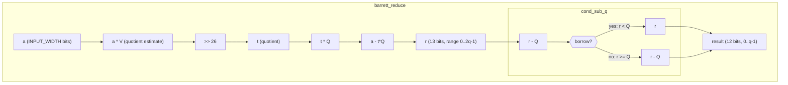
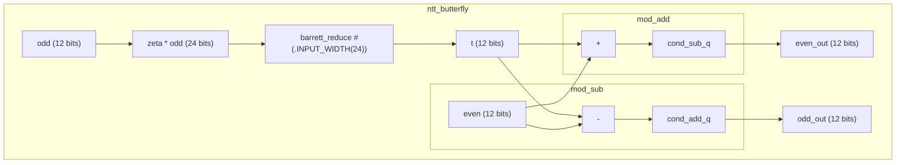
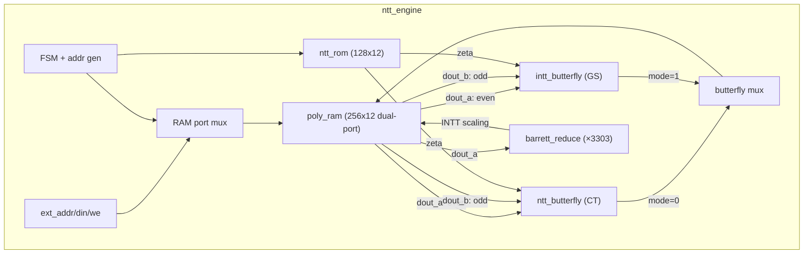
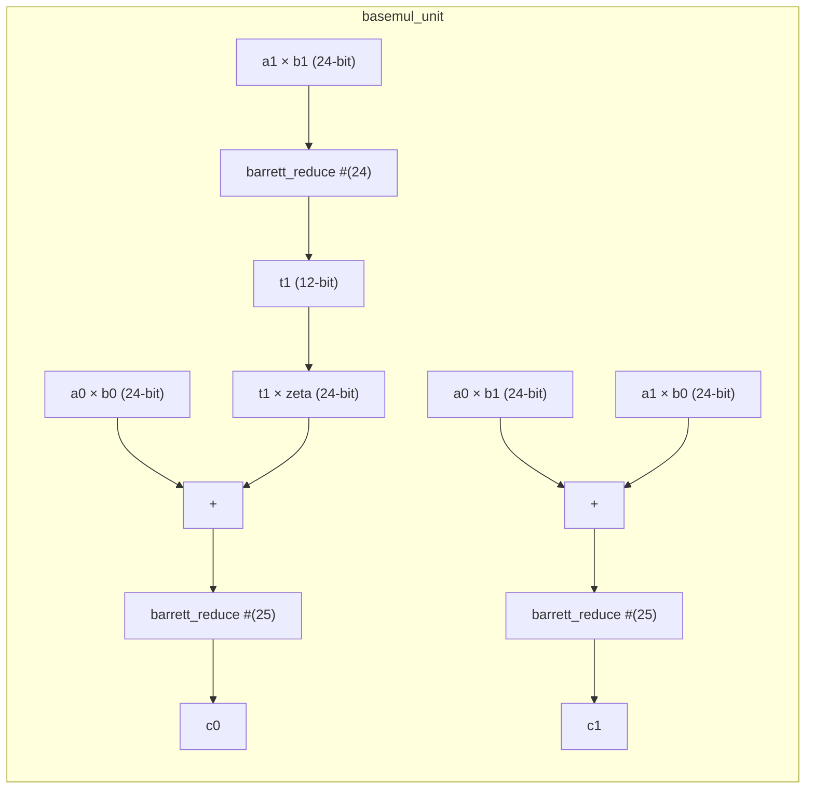
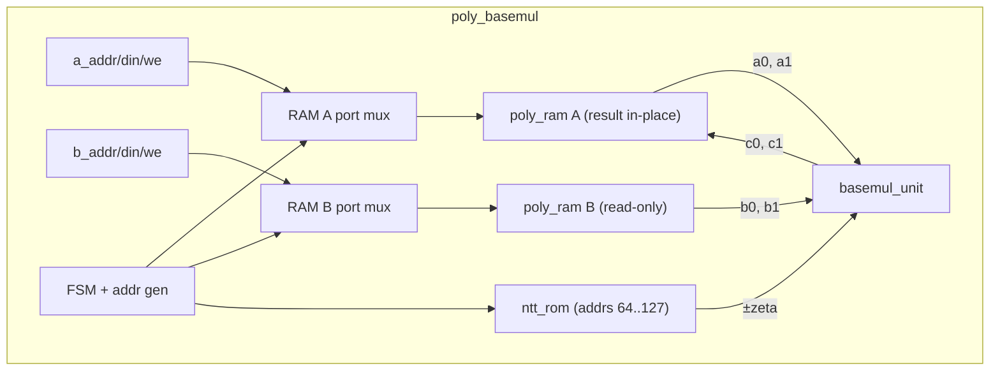
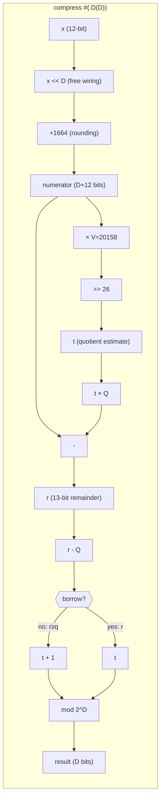
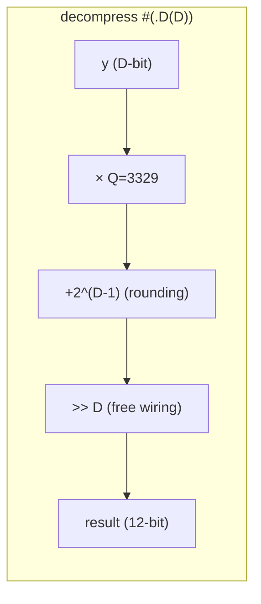

# Warp Core Architecture

## Module Hierarchy

Currently implemented modules (Milestones 1-4: modular arithmetic, NTT butterfly, NTT/INTT engine, basemul):

## NTT Butterfly

The NTT butterfly is the core datapath of CRYSTALS-Kyber. Each butterfly performs:
- `t = zeta * odd_coeff mod q` (Barrett reduction)
- `even' = even + t mod q`
- `odd'  = even - t mod q`

Barrett reduction sits at the heart of each butterfly, reducing the product back to Z_q.

## NTT/INTT Engine

The NTT engine is a sequential FSM that performs 7 layers of 128 butterflies each.
It contains the polynomial RAM, twiddle factor ROM, and both butterfly types internally.

**Timing:**
- Forward NTT: 1800 cycles (7 layers × 257 + 1 done)
- Inverse NTT: 2313 cycles (1800 + 1 init + 512 scale)
- At 100 MHz: 18 µs / 23 µs per NTT/INTT

**FSM States:** `IDLE → LAYER_INIT → BF_READ → BF_WRITE → ... → [SCALE_INIT → SCALE_READ → SCALE_WRITE → ...] → DONE → IDLE`

## Basemul

Pointwise polynomial multiplication in the NTT domain. Kyber's NTT is "incomplete" —
it decomposes a degree-256 polynomial into 128 degree-1 polynomials in Z_q[X]/(X^2 - γ_i).
So "pointwise multiplication" is 128 independent 2×2 basemul operations, processed as
64 pairs (each with +zeta and -zeta).

### basemul_unit (combinational)

Single 2×2 basemul: `(a0 + a1·X)(b0 + b1·X) mod (X² - ζ)`:
- `c0 = a0·b0 + a1·b1·ζ mod q`
- `c1 = a0·b1 + a1·b0 mod q`

Optimized to 3 Barrett reductions (not 5) by accumulating products before reducing:

### poly_basemul (sequential FSM)

Wraps `basemul_unit` with two `poly_ram` instances and one `ntt_rom`:

**Timing:** 257 cycles (64 pairs × 4 cycles + 1 done). At 100 MHz: 2.57 µs.

**FSM States:** `IDLE → READ_POS → WRITE_POS → READ_NEG → WRITE_NEG → ... → DONE → IDLE`

## Development Roadmap

### Milestone 1 -- Modular Arithmetic (complete)
| Module | Status | Description |
|--------|--------|-------------|
| `cond_sub_q` | Done | Conditional subtraction, [0,2q-1] to [0,q-1] |
| `barrett_reduce` | Done | Barrett reduction mod 3329, parameterized width |

### Milestone 2 -- NTT Butterfly (complete)
| Module | Status | Description |
|--------|--------|-------------|
| `cond_add_q` | Done | Conditional addition for subtraction underflow |
| `mod_add` | Done | Modular addition in Z_q |
| `mod_sub` | Done | Modular subtraction in Z_q |
| `ntt_butterfly` | Done | Cooley-Tukey butterfly (multiply + add/sub) |

### Milestone 3 -- NTT/INTT Engine (complete)
| Module | Status | Description |
|--------|--------|-------------|
| `intt_butterfly` | Done | Gentleman-Sande inverse butterfly (add/sub + multiply) |
| `ntt_rom` | Done | Twiddle factor (zeta) lookup ROM, 128 x 12-bit |
| `poly_ram` | Done | True dual-port synchronous RAM, 256 x 12-bit |
| `ntt_engine` | Done | Full 7-layer NTT/INTT FSM with address generation |

### Milestone 4 -- Kyber Operations (complete)
| Module | Status | Description |
|--------|--------|-------------|
| `basemul_unit` | Done | Single 2×2 basemul, combinational (3 Barrett reductions) |
| `poly_basemul` | Done | Pointwise multiply in NTT domain (257 cycles) |
| `compress` / `decompress` | Done | Bit compression for ciphertext (parameterized, all 5 D values) |

### Milestone 5a -- Polynomial Add/Sub (complete)
| Module | Status | Description |
|--------|--------|-------------|
| `poly_addsub` | Done | Coefficient-wise add/sub with mode input (0=add, 1=sub). Pipelined 258-cycle FSM using dual-port RAM for read/write overlap. |

### Milestone 5b -- CBD Sampler (complete)
| Module | Status | Description |
|--------|--------|-------------|
| `cbd_sampler` | Done | Consumes 128 random bytes via byte stream interface, produces 256 CBD η=2 coefficients in [0, q-1]. 129 cycles (byte_valid always high). Dual-port write: both nibbles per byte written simultaneously. |

### Milestone 5c -- kyber_top RAM Bank and Host I/O (complete)
| Module | Status | Description |
|--------|--------|-------------|
| `kyber_top` (skeleton) | Done | 20-slot poly_ram bank (256×12 dual-port each), host port mux for coefficient-level I/O via host_slot/host_addr/host_din/host_dout, IDLE state only. 6 tests verifying host read/write, slot isolation, boundary values, overwrite, and out-of-range defense. |

> **BRAM budget (5c):** 20 (bank) + 1 (ntt_engine) + 2 (poly_basemul) = 23 out of 50 on Artix-7 XC7A35T. (Grew to 24 in 5d with CBD sampler.)

### Milestone 5d -- kyber_top Micro-Op Infrastructure (complete)
| Module | Status | Description |
|--------|--------|-------------|
| COPY_TO/FROM_NTT | Done | Copy 256 coefficients between RAM bank slot and ntt_engine ext port. 257 cycles each direction. |
| COPY_TO/FROM_BM | Done | Copy 256 coefficients between RAM bank slot and poly_basemul RAMs. 257 cycles each direction. |
| RUN_NTT / RUN_BASEMUL | Done | Start sub-engine, wait for done. |
| POLY_ADD/SUB micro-ops | Done | Direct mod_add/mod_sub on bank slots via Port A read + Port B write. 258 cycles. No poly_addsub instantiation needed. |
| COMPRESS/DECOMPRESS micro-ops | Done | Combinational compress/decompress (D=1,4,10) fed during coefficient loop over RAM bank slots. 258 cycles. |
| CBD_SAMPLE micro-op | Done | Two-phase: run cbd_sampler (128 bytes via external stream), then copy result to bank slot. ~386 cycles. External cbd_byte_valid/data/ready interface. |

> **Sub-engines instantiated:** ntt_engine (1), poly_basemul (1), cbd_sampler (1), mod_add (1), mod_sub (1), compress ×3 (D=1,4,10), decompress ×3 (D=1,4,10).
>
> **BRAM budget:** 20 (bank) + 1 (NTT) + 2 (basemul) + 1 (CBD) = 24 out of 50 on Artix-7 XC7A35T.
>
> **Opcodes:** NOP(0), COPY_TO_NTT(1), COPY_FROM_NTT(2), RUN_NTT(3), COPY_TO_BM_A(4), COPY_TO_BM_B(5), COPY_FROM_BM(6), RUN_BASEMUL(7), POLY_ADD(8), POLY_SUB(9), COMPRESS(10), DECOMPRESS(11), CBD_SAMPLE(12).
>
> **Verification:** 16 tests (6 host I/O + 10 micro-op), including end-to-end NTT→basemul→INTT schoolbook round-trip.

### Milestone 5e -- Encaps FSM (complete)
| Module | Status | Description |
|--------|--------|-------------|
| `encaps_ctrl` | Done | Standalone 93-micro-op sequencer FSM. 5 phases: CBD noise (7 ops), NTT(r) (9 ops), A_hat^T · r_hat + e1 → u (54 ops), t_hat^T · r_hat + e2 + m → v (19 ops), compress (4 ops). ~35k cycles at 100 MHz. |
| `encaps_top` | Done | Thin wrapper wiring encaps_ctrl → kyber_top. Host I/O active when idle. CBD byte stream passed through. |

> **Slot allocation:** 0-8: A_hat[j*3+i], 9-11: t_hat, 12: message, 13-15: r/r_hat, 16-18: e1 (then compressed u), 19: e2 (then compressed v). After encaps: u[0..2] uncompressed in slots 0-2, v uncompressed in slot 9, compressed u in slots 16-18 (D=10), compressed v in slot 19 (D=4).
>
> **Verification:** 6 tests — full oracle comparison (u, v), compress values, r_hat slot preservation, two-run independence, host I/O after done, message slot preservation.

### Milestone 5f -- KeyGen, Decrypt, and Round-Trip Integration (complete)
| Module | Status | Description |
|--------|--------|-------------|
| `keygen_ctrl` | Done | 69-micro-op sequencer for ML-KEM-768 KeyGen: CBD sample s[3]+e[3] (6 ops), NTT all 6 (18 ops), matmul A·s_hat+e_hat (3 rows × 15 ops = 45 ops). ~28k cycles. |
| `keygen_top` | Done | Thin wrapper wiring keygen_ctrl → kyber_top. Host I/O active when idle. CBD byte stream for 768 bytes (6 polys). |
| `decaps_ctrl` | Done | 32-micro-op sequencer for K-PKE.Decrypt: decompress u(D=10)+v(D=4) (4 ops), NTT(u) (9 ops), inner product s_hat^T·u_hat (14 ops), INTT+sub+compress(D=1) (5 ops). ~15k cycles. |
| `decaps_top` | Done | Thin wrapper wiring decaps_ctrl → kyber_top. No CBD stream needed. Host preloads compressed ciphertext + s_hat. |
| Round-trip test | Done | Full oracle KeyGen → oracle Encaps → hardware Decrypt recovers original message (256 bits, zero errors). |

> **KeyGen slot allocation:** 0-8: A_hat[i*3+j] (row-major), 9-11: s→s_hat (CBD, NTT'd), 12-14: e→e_hat (CBD, NTT'd). After keygen: t_hat[0..2] in slots 0,3,6; s_hat in slots 9-11.
>
> **Decrypt slot allocation:** 0-2: compressed u (D=10), 3: compressed v (D=4), 4: m' output, 9-11: s_hat. After decrypt: m' in slot 4 (256 binary coefficients).
>
> **Design decision:** decaps_ctrl performs K-PKE.Decrypt only (~32 ops), not full ML-KEM.Decaps (~80+ ops). Re-encryption is orchestrated by the host using encaps_top separately. This avoids needing a pause/resume mechanism for host-side SHAKE computation mid-operation. Hardware constant-time compare deferred to Milestone 6 (when Keccak core enables single-invocation decaps).
>
> **Verification:** 5 keygen tests + 5 decrypt tests (including round-trip). 93 total tests across 21 modules.

### Milestone 6 -- NIST ACVP Compliance Testing
| Module | Status | Description |
|--------|--------|-------------|
| ACVP keyGen vectors | Planned | Deterministic keygen from (d, z) seeds, verify ek and dk against ML-KEM-keyGen-FIPS203 test vectors from NIST ACVP-Server repository (usnistgov/ACVP-Server, gen-val/json-files). |
| ACVP encapDecap vectors | Planned | Encapsulation and decapsulation test vectors from ML-KEM-encapDecap-FIPS203. Hash responses provided via cocotb testbench driving keccak_if with Python SHAKE/SHA3 implementation. |

> **Note:** FIPS 203 splits algorithms into deterministic inner functions accepting randomness as input (enabling reproducible testing) and outer functions that generate randomness. Tests target the deterministic inner functions. All ML-KEM-768 test cases from the ACVP sample vectors must pass.

### Milestone 7 -- Design Documentation
| Module | Status | Description |
|--------|--------|-------------|
| `docs/design_decisions.md` | Planned | Technical design document covering: Barrett constant V=20158 vs C reference's 20159 (unsigned hardware adaptation with exhaustive verification); basemul optimization from 5 to 3 Barrett reductions (accumulate before reducing, safe within Barrett's 77.5M input range); compress via Barrett quotient extraction (reusing Barrett constant for division-by-q without dedicated divider); Python oracle verification strategy (operation-by-operation mirroring with range assertions, schoolbook_mul for algebraic identity verification); NTT engine address generation (shift-based start address is free wiring in hardware, dual butterfly instantiation tradeoff); unsigned-only datapath philosophy (eliminates signed comparison and sign-extension logic). |
| README.md updates | Planned | Add Design Decisions section pointing to docs/design_decisions.md. Update module count and milestone status. Add FPGA resource budget summary. |

### Milestone 8 -- Performance Optimizations
| Module | Status | Description |
|--------|--------|-------------|
| Pipelined NTT butterfly | Planned | Register Barrett multiplication output to break critical path for 200 MHz on Artix-7. Current combinational path: zeta*odd → Barrett multiply → shift → tq → subtract → cond_sub_q. |
| Overlapped butterfly R/W | Planned | With true dual-port RAM, read next butterfly operands while writing current results. Approaches 1 cycle per butterfly instead of 2. |
| Dual-port INTT scaling | Planned | Use both RAM ports during scaling pass to process 2 coefficients per cycle, halving from 512 to 256 cycles. |
| Vivado synthesis | Planned | Target XC7A35T. Timing reports, DSP48E1 mapping verification (Barrett multiplies to DSP slices), resource utilization baseline. |

### Milestone 9 -- ML-DSA (Dilithium) NTT Core
| Module | Status | Description |
|--------|--------|-------------|
| Parameterized arithmetic | Planned | Make kyber_pkg.vh constants (Q, BARRETT_V, COEFF_WIDTH) selectable between Kyber (q=3329, 12-bit) and Dilithium (q=8380417, 23-bit) at compile time. |
| Dilithium NTT/INTT | Planned | Adapted NTT engine for Dilithium's field: different primitive root of unity, twiddle factors, widened poly_ram to 23-bit. Note: 23-bit q requires careful DSP48E1 planning — 25×18 multipliers may need split for 46-bit Barrett products. |
| Dilithium basemul | Planned | Adapted basemul_unit for wider coefficients. |
| ML-DSA ACVP vectors | Planned | Verify NTT intermediate values against FIPS 204 test vectors. |

> **Note:** Goal: single RTL codebase that synthesizes for either ML-KEM or ML-DSA via a top-level parameter, sharing NTT butterfly and Barrett reduction datapath.

### Milestone 10 -- SoC Integration
| Module | Status | Description |
|--------|--------|-------------|
| AXI-Lite wrapper | Planned | Register interface wrapping coefficient-level I/O for standard FPGA bus integration. |
| DMA support | Planned | Bulk polynomial load/store for reduced host interaction overhead. |
| Keccak integration | Planned | Wire open-source or vendor Keccak-f[1600] core to keccak_if port group. |
| Example SoC | Planned | Integration on Artix-7 with soft processor (MicroBlaze or RISC-V) demonstrating full ML-KEM-768 key exchange. Resource utilization and Fmax benchmarks. |

## Compress / Decompress

Bit compression operations for Kyber ciphertext encoding (FIPS 203, Section 4.2.1).
These map 12-bit coefficients in [0, q-1] to d-bit values (compress) and back (decompress),
with controlled approximation error bounded by ceil(q / 2^(d+1)).

### compress (combinational, parameterized by D)

`Compress_q(x, d) = round(2^d · x / q) mod 2^d`

Reuses the Barrett constant (V=20158) to extract the **quotient** instead of the remainder:

### decompress (combinational, parameterized by D)

`Decompress_q(y, d) = round(q · y / 2^d)`

Trivially simple — multiply, add rounding constant, shift:

**D values used in Kyber:** 1 (message), 4/5 (ciphertext v), 10/11 (ciphertext u).

**Verification:** Exhaustive for all D values — 16,645 compress vectors, 3,122 decompress vectors,
plus round-trip error bounds verified for every x in [0, q-1].

## FPGA Target Notes

**Artix-7 (XC7A35T):**
- DSP48E1 slices: 90 available. Barrett multiply (a * V) maps to one DSP.
- Block RAM: 50 x 36Kb. Coefficient storage + twiddle ROM fit comfortably.
- Target clock: 100-200 MHz (TBD after place-and-route).
