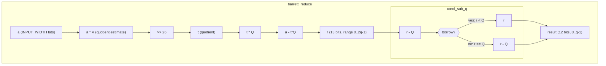
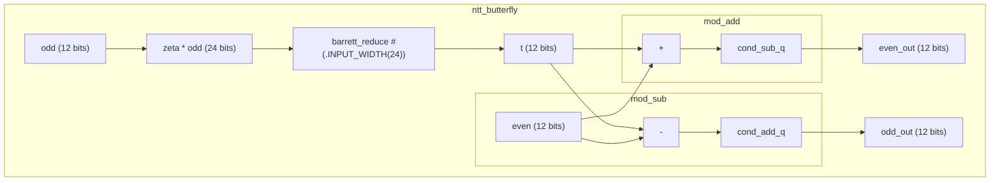
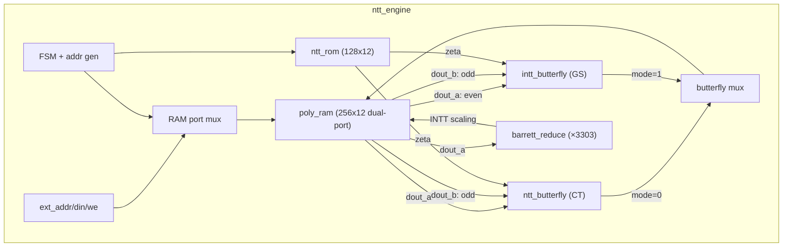
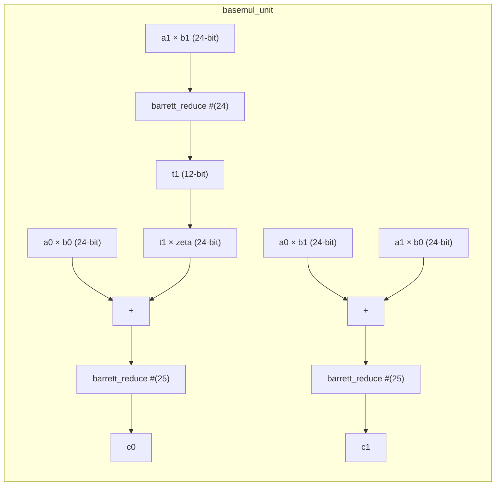
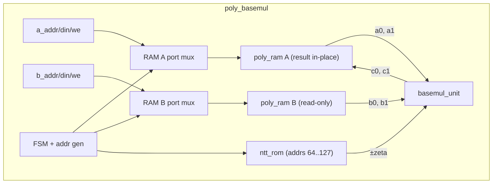
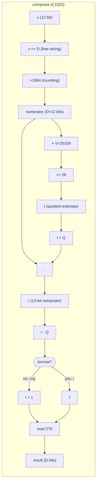
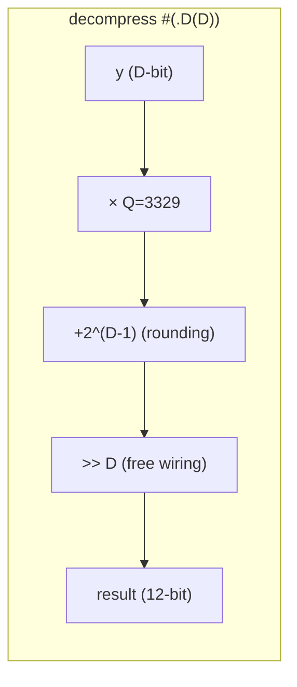

# Warp Core Architecture

## Module Hierarchy

Currently implemented modules (Milestones 1-4: modular arithmetic, NTT butterfly, NTT/INTT engine, basemul):

## NTT Butterfly

The NTT butterfly is the core datapath of CRYSTALS-Kyber. Each butterfly performs:
- `t = zeta * odd_coeff mod q` (Barrett reduction)
- `even' = even + t mod q`
- `odd'  = even - t mod q`

Barrett reduction sits at the heart of each butterfly, reducing the product back to Z_q.

## NTT/INTT Engine

The NTT engine is a sequential FSM that performs 7 layers of 128 butterflies each.
It contains the polynomial RAM, twiddle factor ROM, and both butterfly types internally.

**Timing:**
- Forward NTT: 1800 cycles (7 layers × 257 + 1 done)
- Inverse NTT: 2313 cycles (1800 + 1 init + 512 scale)
- At 100 MHz: 18 µs / 23 µs per NTT/INTT

**FSM States:** `IDLE → LAYER_INIT → BF_READ → BF_WRITE → ... → [SCALE_INIT → SCALE_READ → SCALE_WRITE → ...] → DONE → IDLE`

## Basemul

Pointwise polynomial multiplication in the NTT domain. Kyber's NTT is "incomplete" —
it decomposes a degree-256 polynomial into 128 degree-1 polynomials in Z_q[X]/(X^2 - γ_i).
So "pointwise multiplication" is 128 independent 2×2 basemul operations, processed as
64 pairs (each with +zeta and -zeta).

### basemul_unit (combinational)

Single 2×2 basemul: `(a0 + a1·X)(b0 + b1·X) mod (X² - ζ)`:
- `c0 = a0·b0 + a1·b1·ζ mod q`
- `c1 = a0·b1 + a1·b0 mod q`

Optimized to 3 Barrett reductions (not 5) by accumulating products before reducing:

### poly_basemul (sequential FSM)

Wraps `basemul_unit` with two `poly_ram` instances and one `ntt_rom`:

**Timing:** 257 cycles (64 pairs × 4 cycles + 1 done). At 100 MHz: 2.57 µs.

**FSM States:** `IDLE → READ_POS → WRITE_POS → READ_NEG → WRITE_NEG → ... → DONE → IDLE`

## Development Roadmap

### Milestone 1 -- Modular Arithmetic (complete)
| Module | Status | Description |
|--------|--------|-------------|
| `cond_sub_q` | Done | Conditional subtraction, [0,2q-1] to [0,q-1] |
| `barrett_reduce` | Done | Barrett reduction mod 3329, parameterized width |

### Milestone 2 -- NTT Butterfly (complete)
| Module | Status | Description |
|--------|--------|-------------|
| `cond_add_q` | Done | Conditional addition for subtraction underflow |
| `mod_add` | Done | Modular addition in Z_q |
| `mod_sub` | Done | Modular subtraction in Z_q |
| `ntt_butterfly` | Done | Cooley-Tukey butterfly (multiply + add/sub) |

### Milestone 3 -- NTT/INTT Engine (complete)
| Module | Status | Description |
|--------|--------|-------------|
| `intt_butterfly` | Done | Gentleman-Sande inverse butterfly (add/sub + multiply) |
| `ntt_rom` | Done | Twiddle factor (zeta) lookup ROM, 128 x 12-bit |
| `poly_ram` | Done | True dual-port synchronous RAM, 256 x 12-bit |
| `ntt_engine` | Done | Full 7-layer NTT/INTT FSM with address generation |

### Milestone 4 -- Kyber Operations (in progress)
| Module | Status | Description |
|--------|--------|-------------|
| `basemul_unit` | Done | Single 2×2 basemul, combinational (3 Barrett reductions) |
| `poly_basemul` | Done | Pointwise multiply in NTT domain (257 cycles) |
| `compress` / `decompress` | Done | Bit compression for ciphertext (parameterized, all 5 D values) |
| `kyber_top` | Planned | Top-level encaps/decaps controller |

## Compress / Decompress

Bit compression operations for Kyber ciphertext encoding (FIPS 203, Section 4.2.1).
These map 12-bit coefficients in [0, q-1] to d-bit values (compress) and back (decompress),
with controlled approximation error bounded by ceil(q / 2^(d+1)).

### compress (combinational, parameterized by D)

`Compress_q(x, d) = round(2^d · x / q) mod 2^d`

Reuses the Barrett constant (V=20158) to extract the **quotient** instead of the remainder:

### decompress (combinational, parameterized by D)

`Decompress_q(y, d) = round(q · y / 2^d)`

Trivially simple — multiply, add rounding constant, shift:

**D values used in Kyber:** 1 (message), 4/5 (ciphertext v), 10/11 (ciphertext u).

**Verification:** Exhaustive for all D values — 16,645 compress vectors, 3,122 decompress vectors,
plus round-trip error bounds verified for every x in [0, q-1].

## FPGA Target Notes

**Artix-7 (XC7A35T):**
- DSP48E1 slices: 90 available. Barrett multiply (a * V) maps to one DSP.
- Block RAM: 50 x 36Kb. Coefficient storage + twiddle ROM fit comfortably.
- Target clock: 100-200 MHz (TBD after place-and-route).
