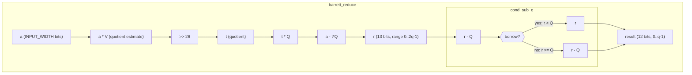
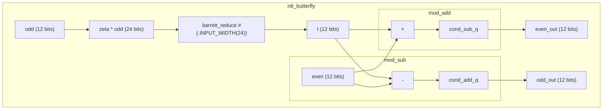
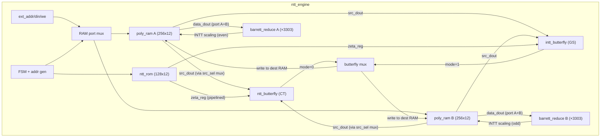
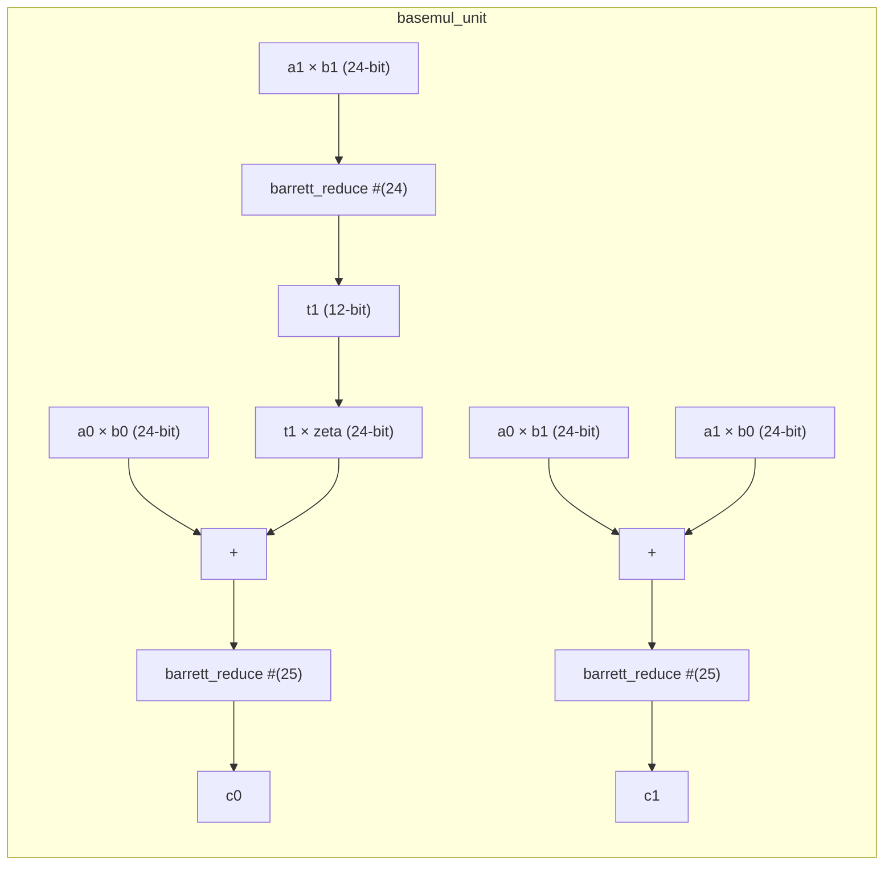
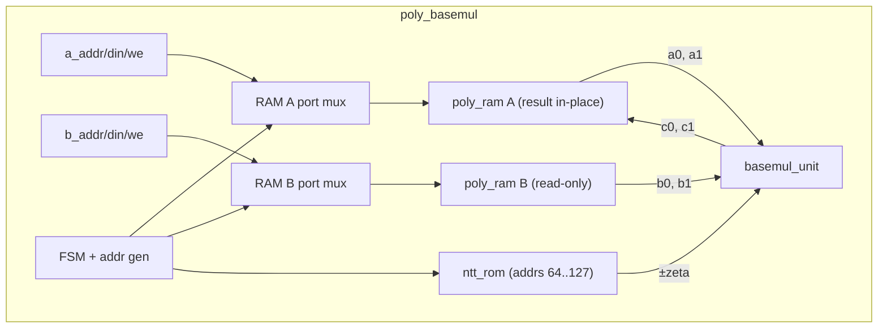
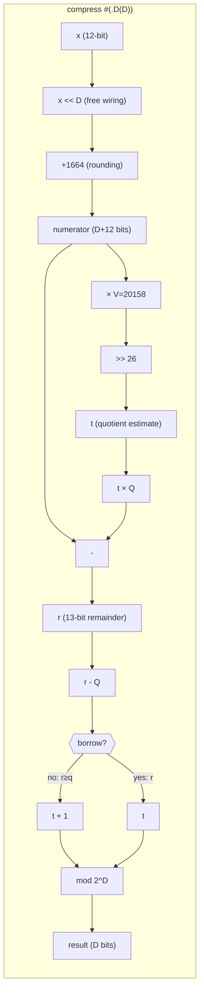
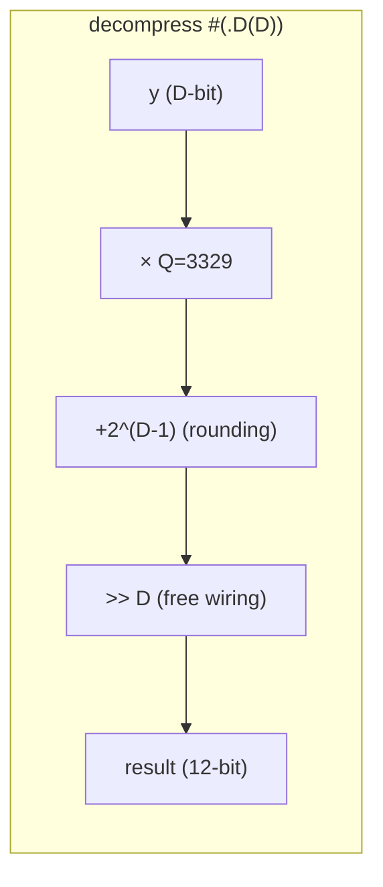

# Warp Core Architecture

## Module Hierarchy

Currently implemented modules (Milestones 1-4: modular arithmetic, NTT butterfly, NTT/INTT engine, basemul):

## NTT Butterfly

The NTT butterfly is the core datapath of CRYSTALS-Kyber. Each butterfly performs:
- `t = zeta * odd_coeff mod q` (Barrett reduction)
- `even' = even + t mod q`
- `odd'  = even - t mod q`

Barrett reduction sits at the heart of each butterfly, reducing the product back to Z_q.

## NTT/INTT Engine

The NTT engine is a sequential FSM that performs 7 layers of 128 butterflies each.
It uses a ping-pong architecture with two poly_ram instances: each layer reads from a
source RAM and writes to a dest RAM, swapping roles per layer. This enables 1-butterfly-per-cycle
throughput (after a 1-cycle prime read). A `data_in_b` register tracks which RAM holds the
current polynomial, flipping after each 7-layer transform.

**Timing:**
- Forward NTT: 911 cycles (7 layers × 130 + 1 done)
- Inverse NTT: 1168 cycles (910 butterfly + 257 dual-port scaling + 1 done)
- At 100 MHz: 9.1 µs / 11.7 µs per NTT/INTT

**FSM States:** `IDLE → LAYER_INIT → BF_PRIME → BF_OVERLAP(×127) → BF_FLUSH → ... → [SCALE_INIT → SCALE_READ → SCALE_WRITE → ...] → DONE → IDLE`

## Basemul

Pointwise polynomial multiplication in the NTT domain. Kyber's NTT is "incomplete" —
it decomposes a degree-256 polynomial into 128 degree-1 polynomials in Z_q[X]/(X^2 - γ_i).
So "pointwise multiplication" is 128 independent 2×2 basemul operations, processed as
64 pairs (each with +zeta and -zeta).

### basemul_unit (combinational)

Single 2×2 basemul: `(a0 + a1·X)(b0 + b1·X) mod (X² - ζ)`:
- `c0 = a0·b0 + a1·b1·ζ mod q`
- `c1 = a0·b1 + a1·b0 mod q`

Optimized to 3 Barrett reductions (not 5) by accumulating products before reducing:

### poly_basemul (sequential FSM)

Wraps `basemul_unit` with two `poly_ram` instances and one `ntt_rom`:

**Timing:** 257 cycles (64 pairs × 4 cycles + 1 done). At 100 MHz: 2.57 µs.

**FSM States:** `IDLE → READ_POS → WRITE_POS → READ_NEG → WRITE_NEG → ... → DONE → IDLE`

## Development Roadmap

### Milestone 1 -- Modular Arithmetic (complete)
| Module | Status | Description |
|--------|--------|-------------|
| `cond_sub_q` | Done | Conditional subtraction, [0,2q-1] to [0,q-1] |
| `barrett_reduce` | Done | Barrett reduction mod 3329, parameterized width |

### Milestone 2 -- NTT Butterfly (complete)
| Module | Status | Description |
|--------|--------|-------------|
| `cond_add_q` | Done | Conditional addition for subtraction underflow |
| `mod_add` | Done | Modular addition in Z_q |
| `mod_sub` | Done | Modular subtraction in Z_q |
| `ntt_butterfly` | Done | Cooley-Tukey butterfly (multiply + add/sub) |

### Milestone 3 -- NTT/INTT Engine (complete)
| Module | Status | Description |
|--------|--------|-------------|
| `intt_butterfly` | Done | Gentleman-Sande inverse butterfly (add/sub + multiply) |
| `ntt_rom` | Done | Twiddle factor (zeta) lookup ROM, 128 x 12-bit |
| `poly_ram` | Done | True dual-port synchronous RAM, 256 x 12-bit |
| `ntt_engine` | Done | Full 7-layer NTT/INTT FSM with address generation |

### Milestone 4 -- Kyber Operations (complete)
| Module | Status | Description |
|--------|--------|-------------|
| `basemul_unit` | Done | Single 2×2 basemul, combinational (3 Barrett reductions) |
| `poly_basemul` | Done | Pointwise multiply in NTT domain (257 cycles) |
| `compress` / `decompress` | Done | Bit compression for ciphertext (parameterized, all 5 D values) |

### Milestone 5a -- Polynomial Add/Sub (complete)
| Module | Status | Description |
|--------|--------|-------------|
| `poly_addsub` | Done | Coefficient-wise add/sub with mode input (0=add, 1=sub). Pipelined 258-cycle FSM using dual-port RAM for read/write overlap. |

### Milestone 5b -- CBD Sampler (complete)
| Module | Status | Description |
|--------|--------|-------------|
| `cbd_sampler` | Done | Consumes 128 random bytes via byte stream interface, produces 256 CBD η=2 coefficients in [0, q-1]. 129 cycles (byte_valid always high). Dual-port write: both nibbles per byte written simultaneously. |

### Milestone 5c -- kyber_top RAM Bank and Host I/O (complete)
| Module | Status | Description |
|--------|--------|-------------|
| `kyber_top` (skeleton) | Done | 20-slot poly_ram bank (256×12 dual-port each), host port mux for coefficient-level I/O via host_slot/host_addr/host_din/host_dout, IDLE state only. 6 tests verifying host read/write, slot isolation, boundary values, overwrite, and out-of-range defense. |

> **BRAM budget (5c):** 20 (bank) + 1 (ntt_engine) + 2 (poly_basemul) = 23 out of 50 on Artix-7 XC7A35T. (Grew to 24 in 5d with CBD sampler.)

### Milestone 5d -- kyber_top Micro-Op Infrastructure (complete)
| Module | Status | Description |
|--------|--------|-------------|
| COPY_TO/FROM_NTT | Done | Copy 256 coefficients between RAM bank slot and ntt_engine ext port. 257 cycles each direction. |
| COPY_TO/FROM_BM | Done | Copy 256 coefficients between RAM bank slot and poly_basemul RAMs. 257 cycles each direction. |
| RUN_NTT / RUN_BASEMUL | Done | Start sub-engine, wait for done. |
| POLY_ADD/SUB micro-ops | Done | Direct mod_add/mod_sub on bank slots via Port A read + Port B write. 258 cycles. No poly_addsub instantiation needed. |
| COMPRESS/DECOMPRESS micro-ops | Done | Combinational compress/decompress (D=1,4,10) fed during coefficient loop over RAM bank slots. 258 cycles. |
| CBD_SAMPLE micro-op | Done | Two-phase: run cbd_sampler (128 bytes via external stream), then copy result to bank slot. ~386 cycles. External cbd_byte_valid/data/ready interface. |

> **Sub-engines instantiated:** ntt_engine (1), poly_basemul (1), cbd_sampler (1), mod_add (1), mod_sub (1), compress ×3 (D=1,4,10), decompress ×3 (D=1,4,10).
>
> **BRAM budget:** 20 (bank) + 2 (NTT ping-pong) + 2 (basemul) + 1 (CBD) = 25 out of 50 on Artix-7 XC7A35T.
>
> **Opcodes:** NOP(0), COPY_TO_NTT(1), COPY_FROM_NTT(2), RUN_NTT(3), COPY_TO_BM_A(4), COPY_TO_BM_B(5), COPY_FROM_BM(6), RUN_BASEMUL(7), POLY_ADD(8), POLY_SUB(9), COMPRESS(10), DECOMPRESS(11), CBD_SAMPLE(12).
>
> **Verification:** 16 tests (6 host I/O + 10 micro-op), including end-to-end NTT→basemul→INTT schoolbook round-trip.

### Milestone 5e -- Encaps FSM (complete)
| Module | Status | Description |
|--------|--------|-------------|
| `encaps_ctrl` | Done | Standalone 93-micro-op sequencer FSM. 5 phases: CBD noise (7 ops), NTT(r) (9 ops), A_hat^T · r_hat + e1 → u (54 ops), t_hat^T · r_hat + e2 + m → v (19 ops), compress (4 ops). ~35k cycles at 100 MHz. |
| `encaps_top` | Done | Thin wrapper wiring encaps_ctrl → kyber_top. Host I/O active when idle. CBD byte stream passed through. |

> **Slot allocation:** 0-8: A_hat[j*3+i], 9-11: t_hat, 12: message, 13-15: r/r_hat, 16-18: e1 (then compressed u), 19: e2 (then compressed v). After encaps: u[0..2] uncompressed in slots 0-2, v uncompressed in slot 9, compressed u in slots 16-18 (D=10), compressed v in slot 19 (D=4).
>
> **Verification:** 6 tests — full oracle comparison (u, v), compress values, r_hat slot preservation, two-run independence, host I/O after done, message slot preservation.

### Milestone 5f -- KeyGen, Decrypt, and Round-Trip Integration (complete)
| Module | Status | Description |
|--------|--------|-------------|
| `keygen_ctrl` | Done | 69-micro-op sequencer for ML-KEM-768 KeyGen: CBD sample s[3]+e[3] (6 ops), NTT all 6 (18 ops), matmul A·s_hat+e_hat (3 rows × 15 ops = 45 ops). ~28k cycles. |
| `keygen_top` | Done | Thin wrapper wiring keygen_ctrl → kyber_top. Host I/O active when idle. CBD byte stream for 768 bytes (6 polys). |
| `decaps_ctrl` | Done | 32-micro-op sequencer for K-PKE.Decrypt: decompress u(D=10)+v(D=4) (4 ops), NTT(u) (9 ops), inner product s_hat^T·u_hat (14 ops), INTT+sub+compress(D=1) (5 ops). ~15k cycles. |
| `decaps_top` | Done | Thin wrapper wiring decaps_ctrl → kyber_top. No CBD stream needed. Host preloads compressed ciphertext + s_hat. |
| Round-trip test | Done | Full oracle KeyGen → oracle Encaps → hardware Decrypt recovers original message (256 bits, zero errors). |

> **KeyGen slot allocation:** 0-8: A_hat[i*3+j] (row-major), 9-11: s→s_hat (CBD, NTT'd), 12-14: e→e_hat (CBD, NTT'd). After keygen: t_hat[0..2] in slots 0,3,6; s_hat in slots 9-11.
>
> **Decrypt slot allocation:** 0-2: compressed u (D=10), 3: compressed v (D=4), 4: m' output, 9-11: s_hat. After decrypt: m' in slot 4 (256 binary coefficients).
>
> **Design decision:** decaps_ctrl performs K-PKE.Decrypt only (~32 ops), not full ML-KEM.Decaps (~80+ ops). Re-encryption is orchestrated by the host using encaps_top separately. This avoids needing a pause/resume mechanism for host-side SHAKE computation mid-operation. Hardware constant-time compare deferred to Milestone 6 (when Keccak core enables single-invocation decaps).
>
> **Verification:** 5 keygen tests + 5 decrypt tests (including round-trip). 93 total tests across 21 modules.

### Milestone 6 -- NIST ACVP Compliance Testing (complete)
| Module | Status | Description |
|--------|--------|-------------|
| `ref/kyber_acvp.py` | Complete | FIPS 203 encoding layer: ByteEncode/ByteDecode (Algorithms 4-5), hash primitives (G/H/J/PRF via hashlib SHA3/SHAKE), SampleNTT rejection sampling (Algorithm 6), full K-PKE and ML-KEM algorithm wrappers (Algorithms 13-18). |
| `ref/test_acvp_oracle.py` | Complete | Pure Python oracle validation against all ML-KEM-768 ACVP vectors: 25 keyGen + 25 encapsulation + 10 decapsulation = 60 vectors. Downloads from usnistgov/ACVP-Server, caches in ref/acvp_vectors/. |
| `tb/acvp_keygen/` | Complete | Hardware keygen ACVP test: expands ACVP seeds via SHAKE/SHA3, loads A_hat and CBD bytes into keygen_top, reads back t_hat/s_hat, ByteEncodes to ek/dk, byte-compares against ACVP expected. 25 vectors. |
| `tb/acvp_encaps/` | Complete | Hardware encaps ACVP test: parses ek, expands A_hat, derives CBD bytes from encryption randomness r, loads into encaps_top, reads compressed ciphertext, ByteEncodes to c, compares c and K against ACVP expected. 25 vectors. |
| `tb/acvp_decaps/` | Complete | Hardware decaps ACVP test: parses dk/c, loads s_hat and compressed ciphertext into decaps_top, reads m', performs Fujisaki-Okamoto re-encryption check in Python, compares K against ACVP expected. 10 vectors (includes implicit rejection cases). |

> **Note:** FIPS 203 splits algorithms into deterministic inner functions accepting randomness as input (enabling reproducible testing) and outer functions that generate randomness. The hardware tests derive exact per-vector inputs (A_hat, CBD bytes, compressed coefficients) from ACVP seeds using Python SHAKE/SHA3, feed them to hardware, then encode hardware outputs back to byte-level for comparison. All 60 ML-KEM-768 ACVP test cases pass.

### Milestone 7 -- Design Documentation (complete)
| Module | Status | Description |
|--------|--------|-------------|
| `docs/design_decisions.md` | Done | Technical design document with 12 sections: Barrett V=20158 (floor vs ceiling), subtract-and-select pattern, basemul 3-Barrett optimization, compress via Barrett quotient extraction, shift-based NTT address generation, 2-cycle read/write butterfly pattern, separate CT/GS instantiation, direct operations on RAM bank, CBD dual-port write trick, unsigned-only datapath philosophy, flat sequencer ROM, ACVP compliance testing strategy. |
| README.md updates | Done | Updated status (24 modules, 96+60 tests), expanded milestone table (1-6), added Design Decisions section, added ACVP testing commands. |

### Milestone 8 -- NTT Performance Optimizations (partial)
| Module | Status | Description |
|--------|--------|-------------|
| Ping-pong overlapped NTT | Done | Two poly_ram instances alternate as source/dest per layer. 1 butterfly/cycle after 1-cycle prime. Forward NTT: 911 cycles (was 1800, 1.98×). Cost: 1 BRAM. |
| Dual-port INTT scaling | Done | Both RAM ports process even/odd coefficients simultaneously via 2 Barrett reducers. INTT scaling: 257 cycles (was 513, 2.0×). INTT total: 1168 cycles (was 2313, 1.98×). |
| Pipelined NTT butterfly | Deferred | Register insertion to break critical path for higher Fmax. Deferred until Vivado synthesis provides timing data. |

### Milestone 9 -- Keccak Core (complete)
| Module | Status | Description |
|--------|--------|-------------|
| `keccak_rc` | Done | Keccak-f[1600] round constant ROM. 24 constants, combinational. From vilya project. |
| `keccak_round` | Done | Single Keccak-f[1600] round (theta, rho, pi, chi, iota). Purely combinational. From vilya project. |
| `keccak_sponge` | Done | Multi-mode sponge controller: SHA3-256 (rate=136, suffix=0x06, 32B out), SHA3-512 (rate=72, suffix=0x06, 64B out), SHAKE-128 (rate=168, suffix=0x1F, unlimited), SHAKE-256 (rate=136, suffix=0x1F, unlimited). 5-state FSM (IDLE, ABSORB, PAD, PERMUTE, SQUEEZE). 1600-bit state register with byte-lane XOR, 24-cycle iterative Keccak-f[1600], FIPS 202 pad10*1. Byte-stream valid/ready handshake. 11 tests against hashlib oracle. |

> **Architecture:** 1600-bit state register (not BRAM — needs byte-addressable XOR during absorb). Iterative permutation reuses one combinational `keccak_round` instance for 24 rounds (24 cycles per permutation). Mode parameters (rate, domain suffix, output length) are combinational from a 2-bit mode register latched on start.
>
> **Resource estimate:** ~1650 FFs (1600 state + 50 counters/FSM), ~3500 LUTs (keccak_round ~3200, sponge controller ~300), 0 BRAM, 0 DSP.
>
> **Verification:** 11 tests — SHA3-256 (empty, short, multiblock), SHA3-512 (short, multiblock), SHAKE-128 (short, 256-byte long squeeze), SHAKE-256 (short, ML-KEM PRF pattern), block boundary padding, back-to-back hashing. All verified against Python hashlib oracle.

### Milestone 10 -- Autonomous ML-KEM (Phase A: KeyGen complete)
| Module | Status | Description |
|--------|--------|-------------|
| `auto_keygen_ctrl` | Done | Master sequencer for autonomous KeyGen: SEED_ABSORB (SHA3-512), G_SQUEEZE (rho/sigma), EXPAND_A (9x SampleNTT via SHAKE-128), PRF_CBD (6x SHAKE-256), POLY_OPS (63 micro-ops: NTT + matmul). ~35k cycles. |
| `auto_keygen_top` | Done | Wrapper: auto_keygen_ctrl + keccak_sponge + kyber_top. CBD bridge mux routes Keccak squeeze to CBD sampler. Host port muxed between controller (busy) and external (idle). rho readback via byte-indexed register. |
| Autonomous Encaps | Planned | Single-invocation ML-KEM-768 Encaps with hardware hashing. |
| Autonomous Decaps | Planned | Single-invocation ML-KEM-768 Decaps with hardware hashing + FO re-encryption. |

> **Architecture:** kyber_top remains UNMODIFIED. All new logic lives in auto_keygen_ctrl (sequencer) and auto_keygen_top (wrapper with muxing). The Keccak sponge is shared across all hash operations (G, XOF, PRF) via mode switching.
>
> **Squeeze handshake timing:** Registered `squeeze_ready` (NBA) means Keccak advances `byte_idx` one cycle after assertion, but `squeeze_data` is combinational from `byte_idx`. A `squeeze_ack` flag ensures each byte is captured only once: capture when ack=0, wait when ack=1 (2 cycles per squeeze byte).
>
> **SampleNTT:** 3-byte rejection sampling (d1={b1[3:0],b0}, d2={b2,b1[7:4]}, accept if < 3329). Writes directly to bank slots via host port. ~580 squeeze+sample cycles per polynomial (varies with rejection rate).
>
> **Resource estimate (additional):** ~2200 FFs (512 rho/sigma + 1650 keccak_sponge + ~50 counters), ~3700 LUTs (3500 keccak_round + ~200 ctrl logic), 0 BRAM, 0 DSP. Total design: ~5200 FFs, ~10700 LUTs, 25 BRAM, 3 DSP.
>
> **Verification:** 5 tests (single vector, rho readback, back-to-back, cycle count, 25 ACVP vectors). All 25 ML-KEM-768 ACVP keyGen vectors pass through fully autonomous hardware path.

### Milestone 11 -- Dilithium NTT Core
| Module | Status | Description |
|--------|--------|-------------|
| Parameterized shared modules | Planned | Width-parameterize `poly_ram`, `mod_add`, `mod_sub`, `cond_sub_q`, `cond_add_q` for both 12-bit (Kyber) and 23-bit (Dilithium). Regression-test Kyber after parameterization. |
| `solinas_reduce` | Planned | Modular reduction for q=8380417=2^23-2^13+1 via iterated shift-subtract. Three iterations collapse 46-bit input to [0, ~q]. Zero DSPs — pure fabric logic. Replaces Barrett for Dilithium. |
| `dil_ntt_butterfly` / `dil_intt_butterfly` | Planned | 23-bit Cooley-Tukey / Gentleman-Sande butterflies. 23×23 multiply uses 2-DSP split (17-bit × 23-bit + 6-bit × 23-bit, cascade via PCOUT). Solinas reduction instead of Barrett. |
| `dil_ntt_rom` | Planned | 256×23-bit twiddle factor ROM. ζ=1753 (primitive 512th root of unity mod q), 8-bit bit-reversal indexing. |
| `dil_ntt_engine` | Planned | 8-layer ping-pong NTT/INTT engine, reusing FSM architecture from Kyber engine. Scale factor: 256^-1 mod q = 8347681. Forward ~1041 cycles, INTT ~1298 cycles (estimated). |
| Pointwise multiply | Planned | Element-wise (a_i × b_i) mod q for 256 coefficients. Simpler than Kyber basemul — Dilithium's complete NTT means no degree-1 polynomial pairs. |

> **Key difference from Kyber:** Dilithium's NTT is a complete 8-layer transform (not 7-layer incomplete). q=8380417 is a Solinas prime, so modular reduction uses shift-subtract chains instead of Barrett multiplication — zero DSPs for reduction, ~2-3 LUT levels of delay. The 23×23 butterfly multiply needs 2 DSP48E1 slices (split via cascade), but total DSP count per butterfly (~2) is actually lower than Kyber (~3, due to Barrett multiplies).

### Milestone 12 -- ML-DSA (FIPS 204)
| Module | Status | Description |
|--------|--------|-------------|
| `power2round` | Planned | Split coefficient into (a1, a0) where a = a1·2^13 + a0. Shift-and-add only, no DSP. |
| `decompose` | Planned | Split coefficient for signature hint system. Magic-multiply constants for γ2=(q-1)/32 and γ2=(q-1)/88. |
| `make_hint` / `use_hint` | Planned | Hint generation and application for signature compression. Combinational comparators + increment logic. |
| `chknorm` | Planned | Infinity-norm check on polynomial (all coefficients within bound). Pipelined 256-element comparator with OR-tree reduction. |
| Rejection sampling | Planned | Uniform mod q (3 bytes, accept if <q, ~0.1% rejection), uniform_eta, SampleInBall (challenge polynomial with τ nonzero ±1 entries via SHAKE-256). |
| `dil_top` | Planned | Dilithium polynomial bank + micro-op FSM. Reuse kyber_top slot architecture with wider coefficients and Dilithium-specific opcodes (Power2Round, Decompose, norm check, pointwise multiply). |
| ML-DSA-65 controllers | Planned | KeyGen, Sign, and Verify sequencers. Sign includes rejection loop (re-sign if norm check fails). |
| FIPS 204 ACVP compliance | Planned | Verify against NIST ML-DSA-65 ACVP test vectors. |

### Milestone 13 -- AXI-Lite Wrapper
| Module | Status | Description |
|--------|--------|-------------|
| AXI-Lite register interface | Planned | Memory-mapped control/status for both ML-KEM and ML-DSA operations. Opcode dispatch, polynomial load/store, interrupt on completion. |
| Bulk transfer interface | Planned | DMA-friendly burst mode for polynomial and key material I/O. |
| Integration testbench | Planned | AXI-Lite BFM (bus functional model) exercising full KeyGen/Encaps/Decaps/Sign/Verify sequences. |

### Milestone 14 -- FPGA Synthesis & Optimization
| Module | Status | Description |
|--------|--------|-------------|
| Vivado synthesis | Planned | Target XC7A35T. Resource utilization, DSP48E1 mapping verification, initial timing report. |
| Timing closure | Planned | Pipelined butterfly (register insertion) if critical path exceeds target Fmax. Separate analysis for Kyber and Dilithium datapaths. |
| Performance benchmarks | Planned | Cycle-accurate operation latency, throughput (ops/sec), comparison with published ML-KEM/ML-DSA hardware implementations. |

## Compress / Decompress

Bit compression operations for Kyber ciphertext encoding (FIPS 203, Section 4.2.1).
These map 12-bit coefficients in [0, q-1] to d-bit values (compress) and back (decompress),
with controlled approximation error bounded by ceil(q / 2^(d+1)).

### compress (combinational, parameterized by D)

`Compress_q(x, d) = round(2^d · x / q) mod 2^d`

Reuses the Barrett constant (V=20158) to extract the **quotient** instead of the remainder:

### decompress (combinational, parameterized by D)

`Decompress_q(y, d) = round(q · y / 2^d)`

Trivially simple — multiply, add rounding constant, shift:

**D values used in Kyber:** 1 (message), 4/5 (ciphertext v), 10/11 (ciphertext u).

**Verification:** Exhaustive for all D values — 16,645 compress vectors, 3,122 decompress vectors,
plus round-trip error bounds verified for every x in [0, q-1].

## FPGA Target Notes

**Artix-7 (XC7A35T):**
- DSP48E1 slices: 90 available. Barrett multiply (a * V) maps to one DSP.
- Block RAM: 50 x 36Kb. Coefficient storage + twiddle ROM fit comfortably.
- Target clock: 100-200 MHz (TBD after place-and-route).
