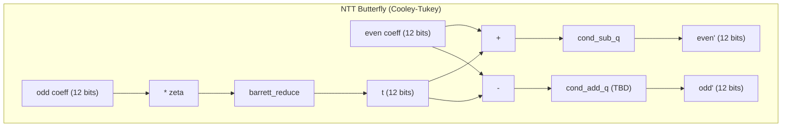

# Warp Core Architecture

## Module Hierarchy

Currently implemented modules (Milestone 1: modular arithmetic primitives):

## NTT Butterfly — Target Architecture

The NTT butterfly is the core datapath of CRYSTALS-Kyber. Each butterfly performs:
- `t = zeta * odd_coeff mod q` (Montgomery or Barrett multiplication)
- `even' = even + t mod q`
- `odd'  = even - t mod q`

Barrett reduction sits at the heart of each butterfly, reducing the product back to Z_q.

## Development Roadmap

### Milestone 1 -- Modular Arithmetic (complete)
| Module | Status | Description |
|--------|--------|-------------|
| `cond_sub_q` | Done | Conditional subtraction, [0,2q-1] to [0,q-1] |
| `barrett_reduce` | Done | Barrett reduction mod 3329, parameterized width |

### Milestone 2 -- NTT Butterfly
| Module | Status | Description |
|--------|--------|-------------|
| `cond_add_q` | Planned | Conditional addition for subtraction underflow |
| `mod_add` | Planned | Modular addition in Z_q |
| `mod_sub` | Planned | Modular subtraction in Z_q |
| `ntt_butterfly` | Planned | Cooley-Tukey butterfly (multiply + add/sub) |

### Milestone 3 -- NTT/INTT Engine
| Module | Status | Description |
|--------|--------|-------------|
| `ntt_rom` | Planned | Twiddle factor (zeta) lookup ROM |
| `ntt_engine` | Planned | Full 7-layer NTT with address generation |
| `poly_ram` | Planned | Dual-port coefficient RAM (256 x 12-bit) |

### Milestone 4 -- Kyber Operations
| Module | Status | Description |
|--------|--------|-------------|
| `poly_basemul` | Planned | Pointwise multiply in NTT domain |
| `compress` / `decompress` | Planned | Bit compression for ciphertext |
| `kyber_top` | Planned | Top-level encaps/decaps controller |

## FPGA Target Notes

**Artix-7 (XC7A35T):**
- DSP48E1 slices: 90 available. Barrett multiply (a * V) maps to one DSP.
- Block RAM: 50 x 36Kb. Coefficient storage + twiddle ROM fit comfortably.
- Target clock: 100-200 MHz (TBD after place-and-route).
